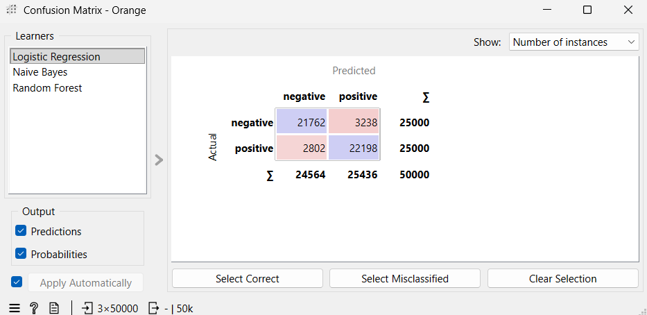
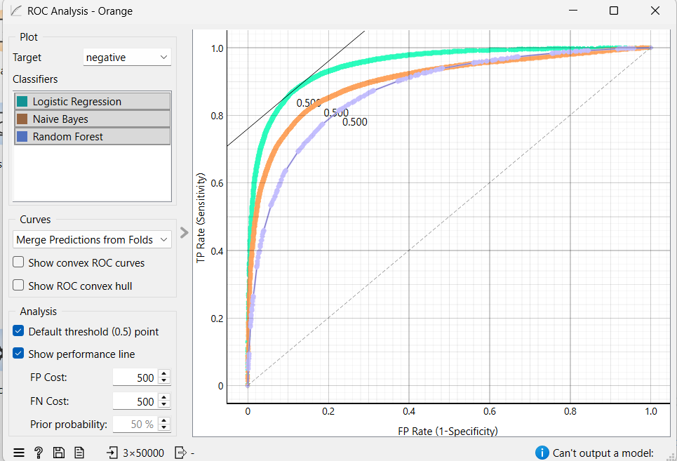

# 🎬 Sentiment Classification of Movie Reviews  

This project demonstrates an **end-to-end NLP pipeline** for classifying IMDB movie reviews into **Positive** or **Negative** sentiments using **Orange Data Mining**.  
The workflow includes preprocessing, feature extraction, model training, evaluation, and prediction for unseen reviews.  

---

## 📂 Dataset  
- **Source**: [Kaggle Movie Reviews based on Sentiment](https://www.kaggle.com/code/christinastalin/sentiment-analysis)  
- **Size**: 50,000 reviews  
  - 25,000 Positive  
  - 25,000 Negative  

---

## ⚙️ Preprocessing Steps  
The following text normalization steps were applied:  

- Lowercasing  
- HTML tag parsing  
- Tokenization  
- Stopword removal  
- Porter Stemmer / Lemmatization  
- Feature Filtering:  
  - Keep terms with document frequency between **0.01 – 0.85**  
  - Retain **Top 5,000 features**  

**Feature Representation**:  
- Bag of Words (BoW)  
- Smoothed Inverse Document Frequency (IDF)  
- L2 Regularization  

---

## 🤖 Models Implemented  
Three machine learning models were trained and compared:  

- **Logistic Regression** ✅ (Chosen final model)  
- Naive Bayes  
- Random Forest  

---

## 📊 Model Evaluation  

### Metrics  
--  

### Confusion Matrix  
*(Visualizing model predictions vs actual labels)*  
  

### ROC Analysis  
*(Receiver Operating Characteristic curve for model comparison)*  
  

### Word Cloud  
*(Most frequent terms after preprocessing)*  
  

---

## 🔮 Final Prediction Pipeline  
The **right-most NLP pipeline** in the Orange workflow is the deployed solution.  

**Steps for prediction:**  
1. Input new reviews (via **File** or **Text** widget).  
2. Preprocessing & feature extraction applied automatically.  
3. Prediction output: **Positive / Negative sentiment** using the Logistic Regression model.  

---

## 🚀 Usage  
1. Open the Orange workflow file.  
2. Run the workflow with provided dataset or custom input.  

3. View evaluation metrics, confusion matrix, and ROC analysis in the widgets.  
4. Use the deployed pipeline for real-time predictions on unseen reviews.  

---
